# ExpressSend

## 背景

我希望在大学校园中创建一个快递顺带帮取的平台，在一定程度上减少同学们在领取快递上所花费的时间。该平台我取名叫顺达，平台交易通过积分实现，每个新注册的用户都能获取五个初始积分。

## 功能模块

#### 登录登出

* 利用**极光认证**服务实现手机号码一键登录；
* 登录实现过程：本地预登录、获取手机号掩码、获取完整手机号码、进入应用内部、登录极光IM；
* 登出实现过程：更改应用服务器用户登录状态、退出极光IM、修改本地用户登录状态、弹出登录授权页面；

#### 资料管理

* 用户资料项主要有昵称、头像、电话号码（不可更改）、大学名称、宿舍楼、寝室号；
* 用户头像存储于**阿里云OSS**对象存储服务器，通过配置个人域名，上传图片后返回图片URL，存储于应用后台服务器；
* 其它用户资料均在应用服务器上进行**CRUD**；
* 客户端APP利用**Room**建立本地数据库，存储用户资料表，时刻保持本地用户信息与后台数据库资料表信息保持一致；

#### 即时通信

* 使用极光IM实现即时通信功能；
* 传输类型：文字、图片；
* 发送消息过程：封装消息（ImageContent、TextContent、CustomContent）、发送消息、将消息添加至本地Adapter；
* 接受消息过程：判断接受消息的类型（ImageContent、TextContent、CustomContent）、将消息添加至本地Adapter；

#### 订单管理

* 订单操作用户：发单者和接单者，二者均可以筛选订单；
* 面向发单者的订单操作：取消订单、修改订单、确认收货、评价订单、删除订单；
* 面向接单者的订单操作：开始派单、查看订单详情、删除订单；

## 技术点

#### 三方库

[Glide](https://github.com/bumptech/glide)、[Circleimageview](https://github.com/hdodenhof/CircleImageView)、[BannerViewPager](https://github.com/zhpanvip/BannerViewPager)、[ImmersionBar](https://github.com/gyf-dev/ImmersionBar)、[Retrofit](https://github.com/square/retrofit)、[PictureSelector](https://github.com/labmem005/PictureSelector)、[SmartRefreshLayout](https://github.com/scwang90/SmartRefreshLayout)、[PhotoView](https://github.com/wanglu1209/PhotoViewer)、[Android-PromptDialog](https://github.com/limxing/Android-PromptDialog)

#### 三方服务

阿里云OSS、极光认证、极光IM

#### 客户端技术

MVVM（ViewModel、Repository、Mode）、Room、Kotlin（Java）

## 运行结果展示

                     
  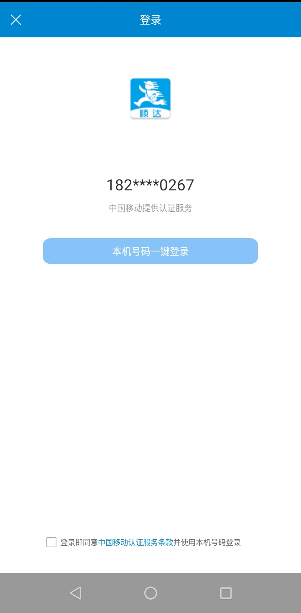
  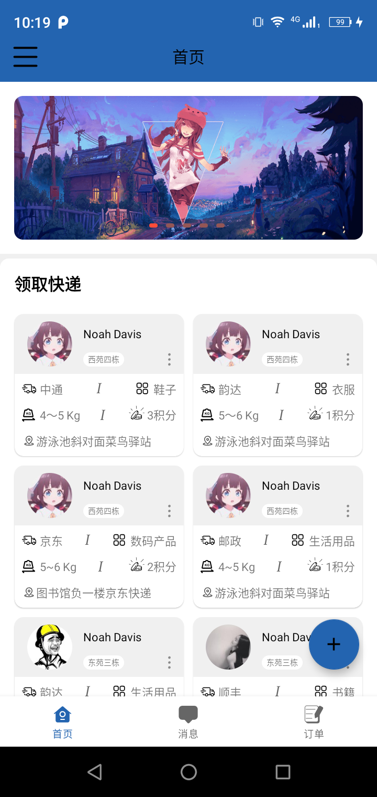
  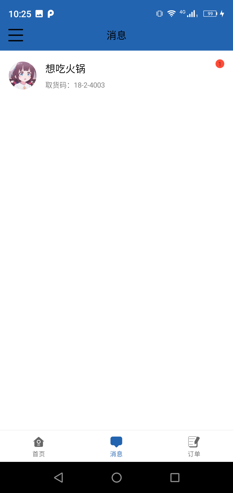

  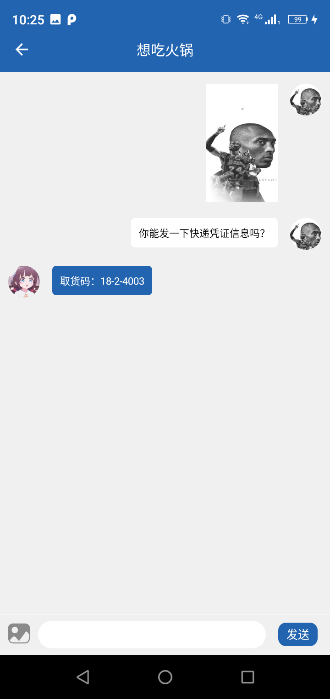                       	 
  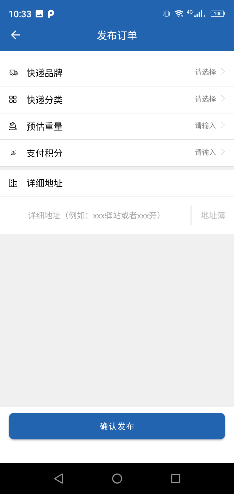
  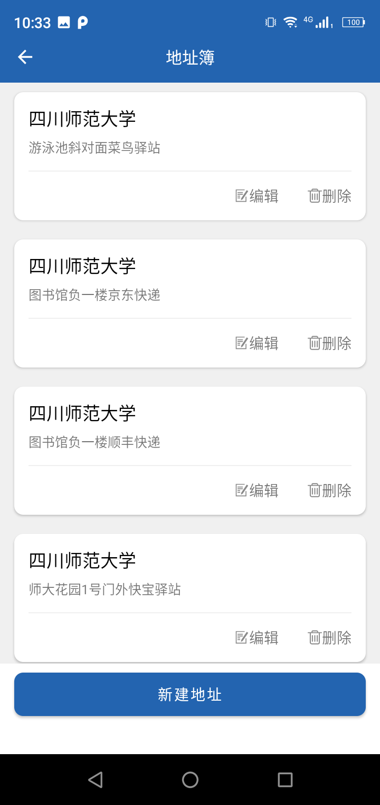

  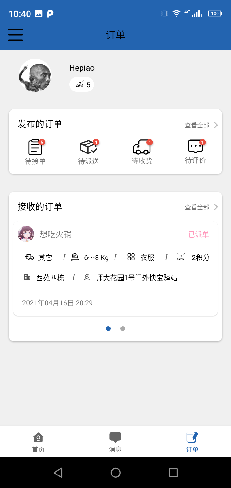
  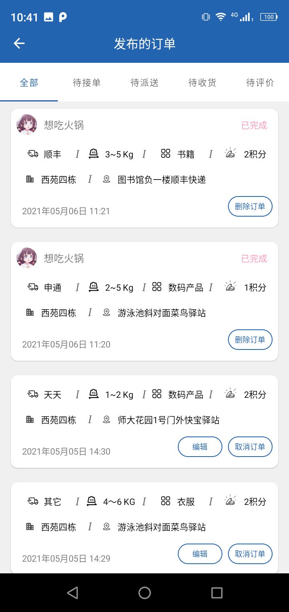
  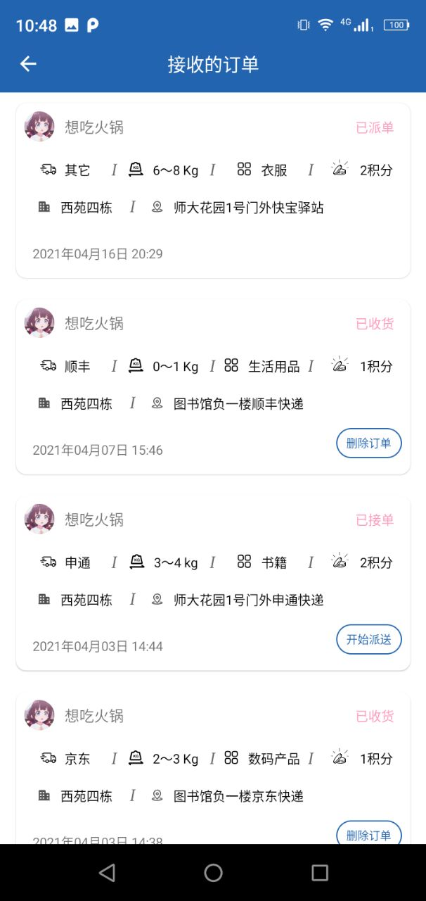

  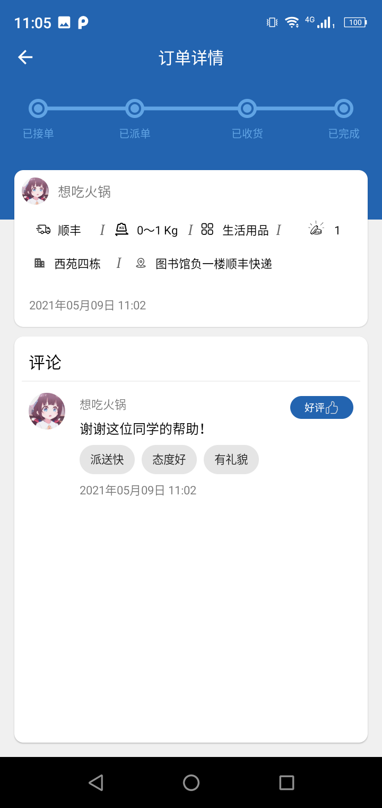
  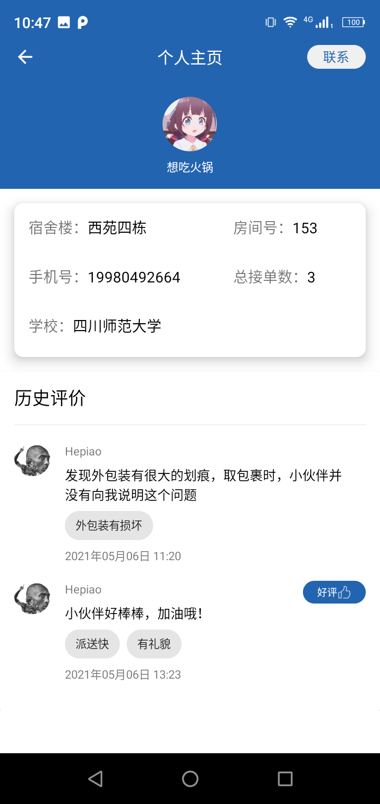
  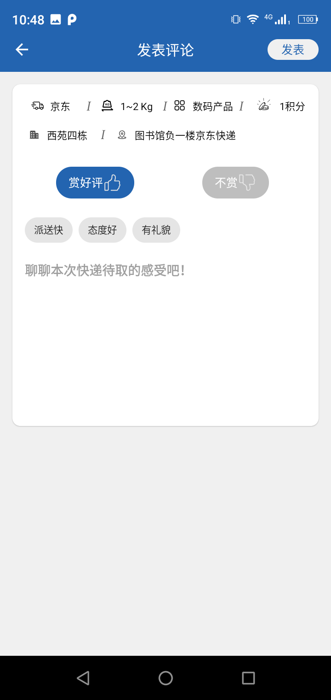

  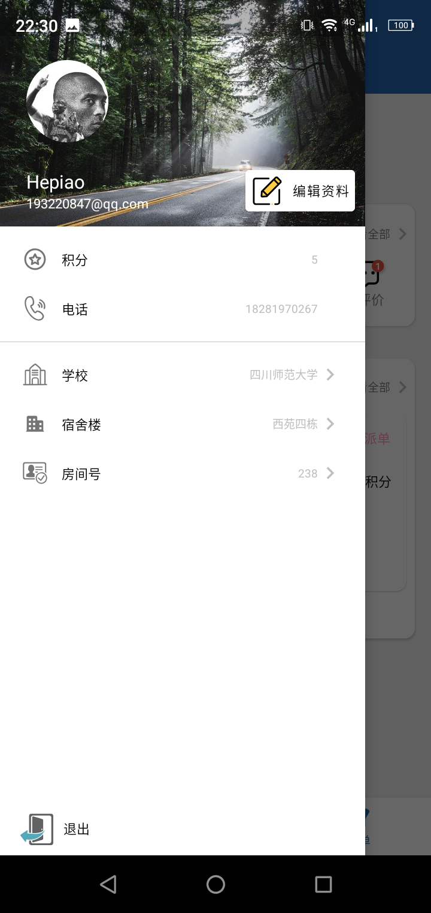
  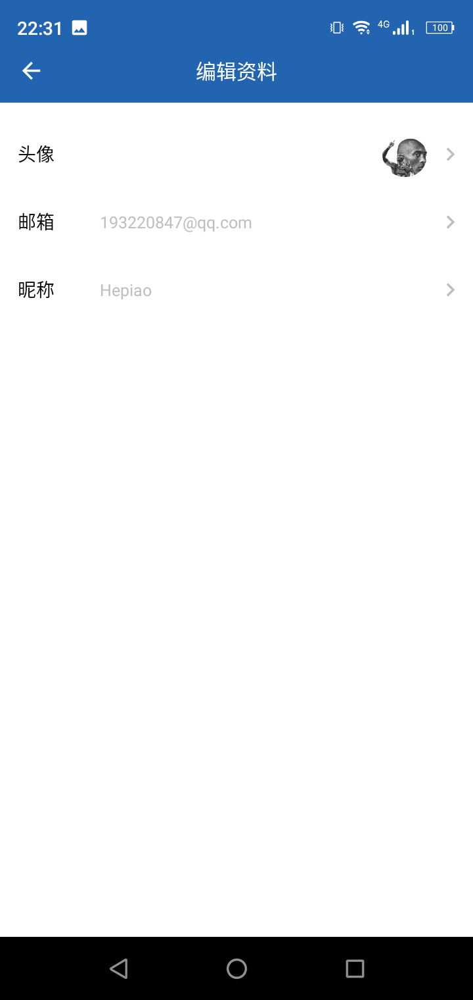
  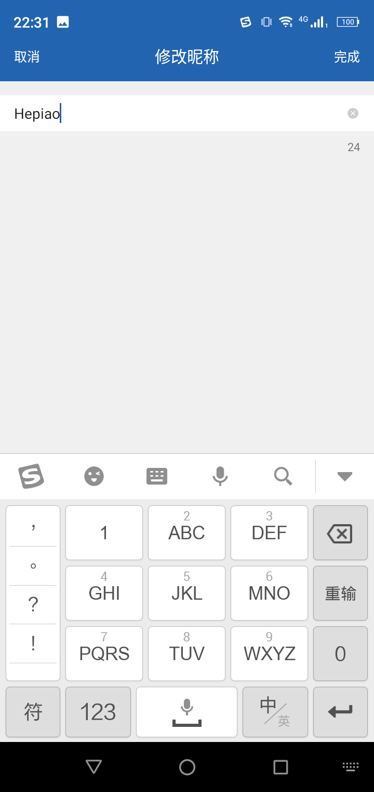

## 总结

#### 优缺点：

* 课题设计需求基本完成；
* 用户交互流畅性不错；
* 用户交互界面反馈及时；
* 异常情况应用欠缺提醒；
* 即时通信的消息通知提示[底部Bottom、系统通知栏]待完善；

#### 待提升：

* 待建立用户举报渠道；

* 可以增加定位和用户信息认证功能；
* 展示用户接单量排名（每日/每周/每月）；
